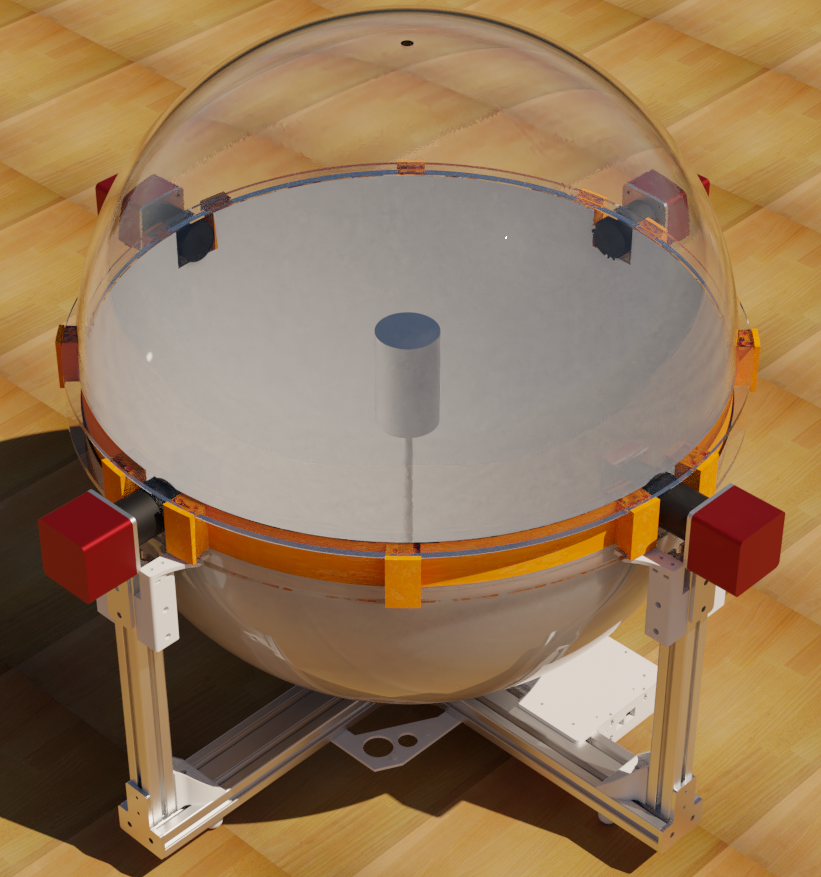
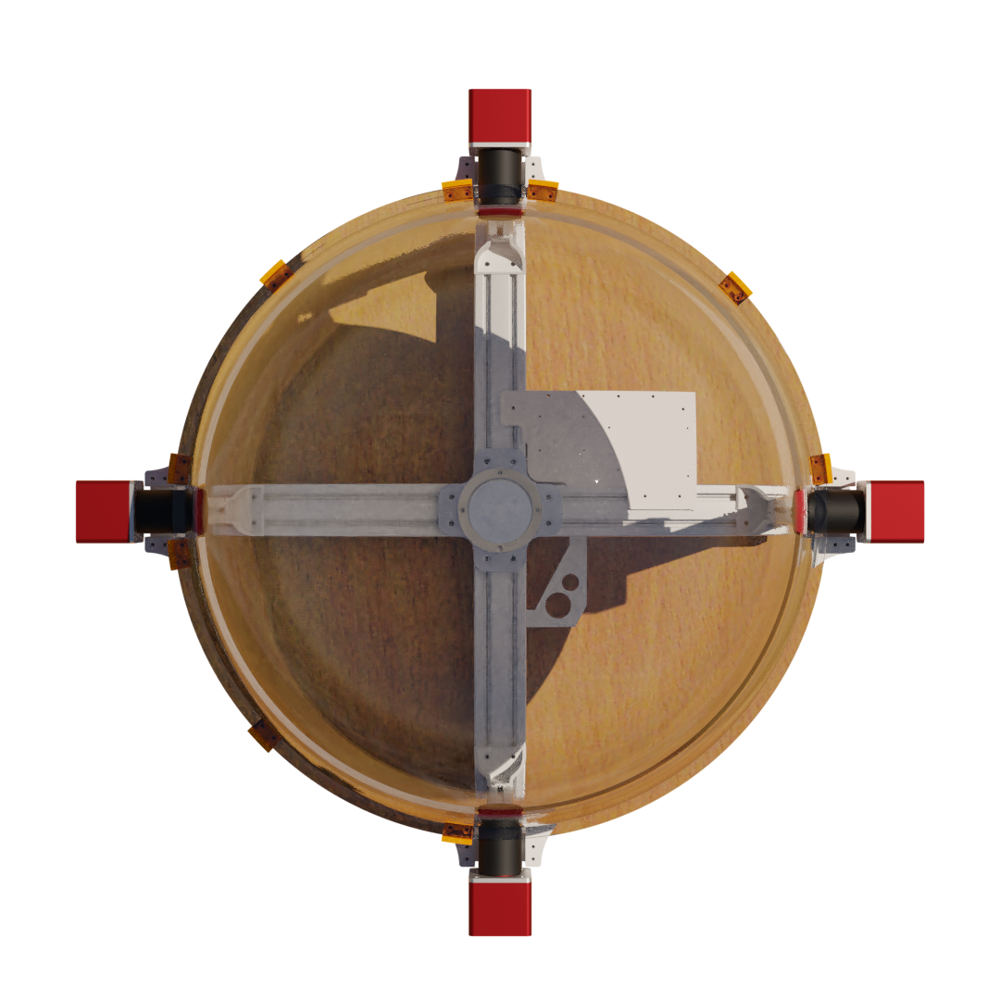
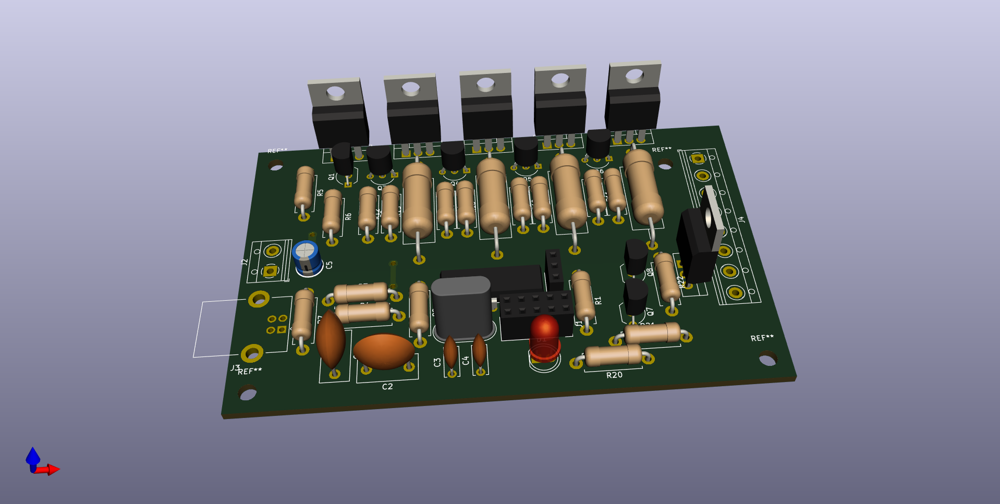
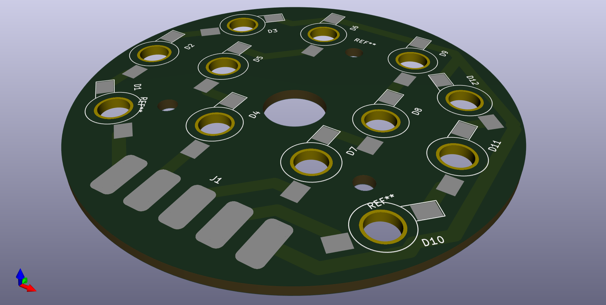

# Fluorescent lubricant detector

This is the hardware to a lubricant detection system that uses flurecent indecator materials to detect the thikness of lubricants on arbitrary surfaces.
It performs image detection and undistrotion of the surface under test, lighting and angle correction as well as the application of callibration curves to aquire accurate thikness data in a fast and non-contact fashion.

Hardware wise this is implemented using a integrating sphere to light an object under test evenly with a known irradiance and subsequently aquireing the surface of the object under test using a four cameras.

- The implentaton of the algorithums used can be found in this shared libary: https://gitlab.com/CKCSGLA/uvowunwrap
- The camera interface can be found here: https://gitlab.com/CKCSGLA/uvoscam
- A Gui frontend for this system can be found here: https://gitlab.com/CKCSGLA/LubricantThicknessMapper

- The LedController directory contains the design of and the kicad files for a usb attached led contoller board with linear regulation and camera triggering.
	-  Kicad can be found here: https://www.kicad.org/
- The LedPcb directory contains the design of and the kicad files for a mechanical adapter board for the LED packages to be used with the LedController PCB.
- IntegratingSphere contains CAD fils for the mechanical setup of the integrating sphere and the assoicated equipment.

License: CC BY-SA 2.0, see https://creativecommons.org/licenses/by-sa/2.0/legalcode

